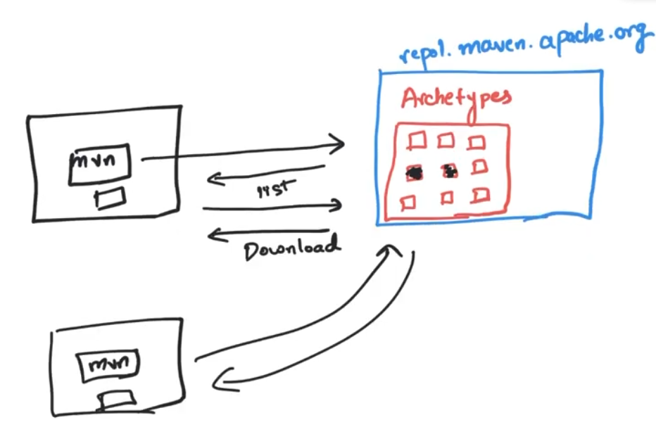
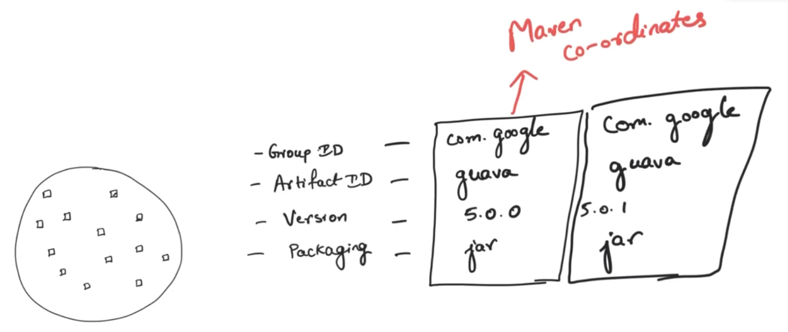
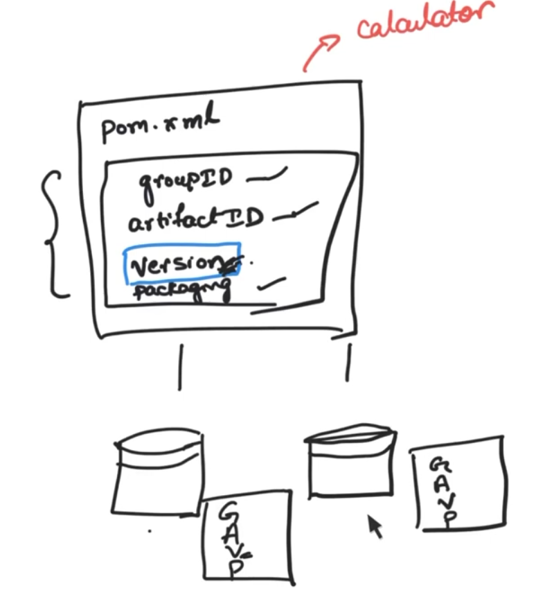
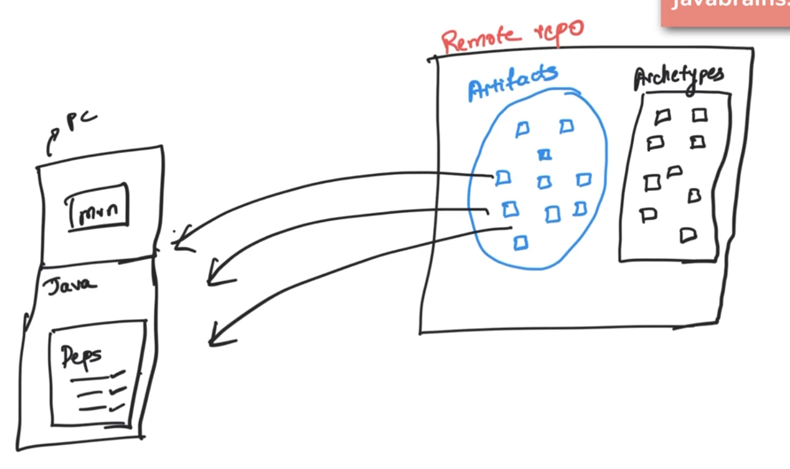
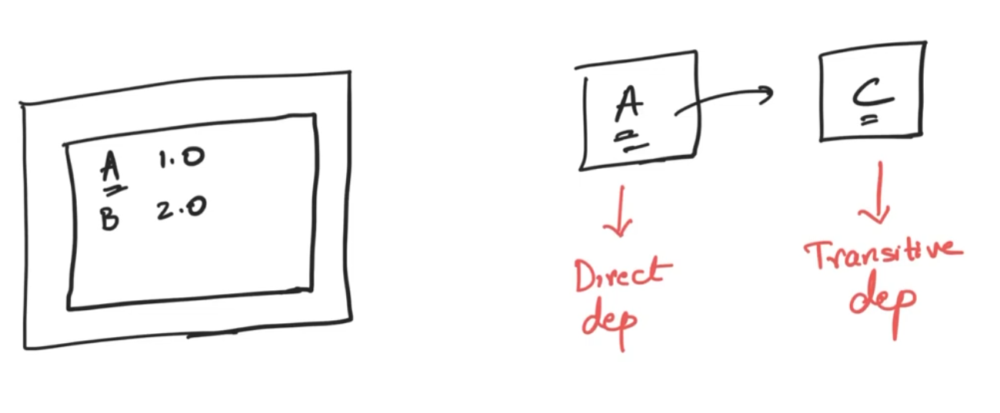
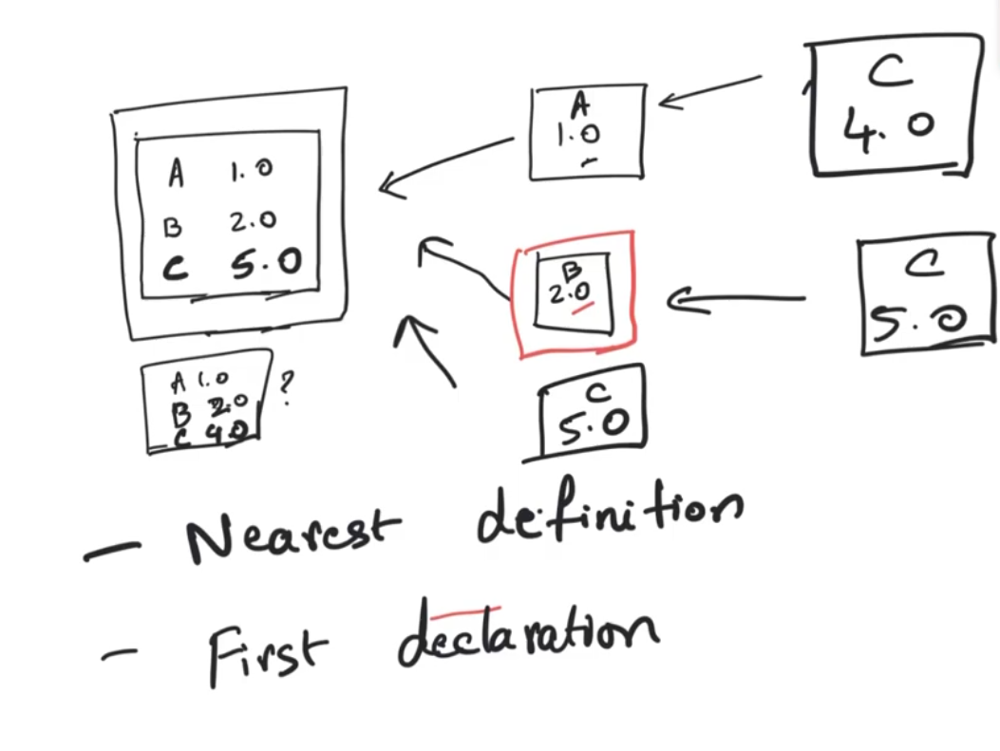
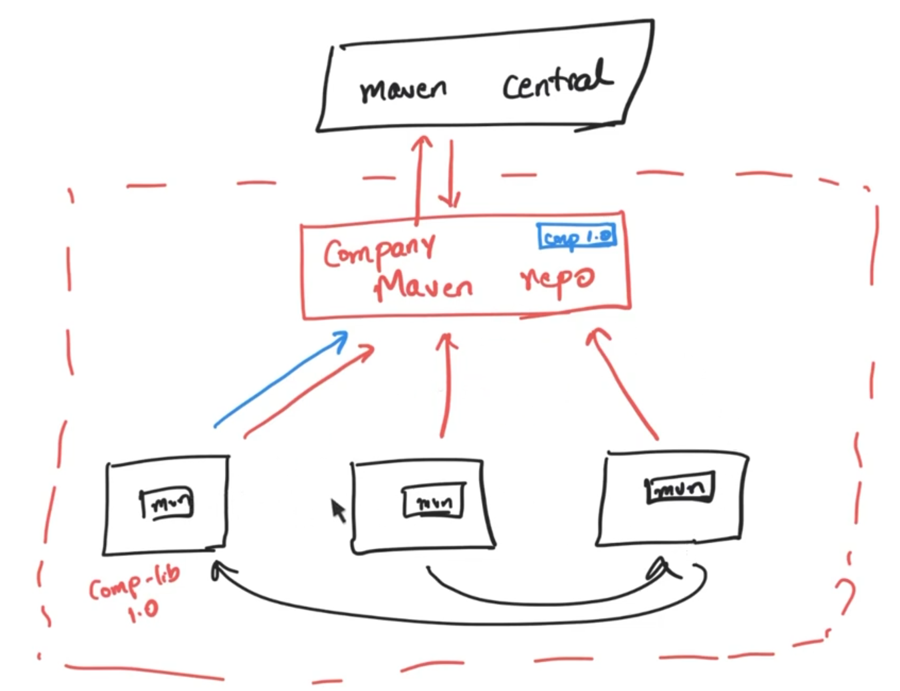
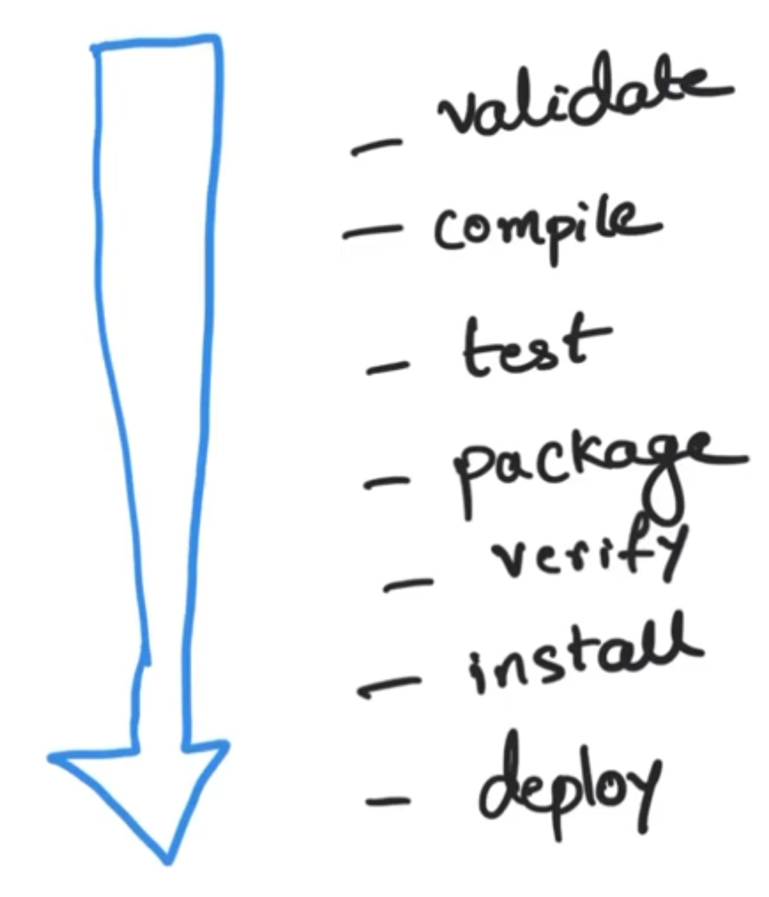
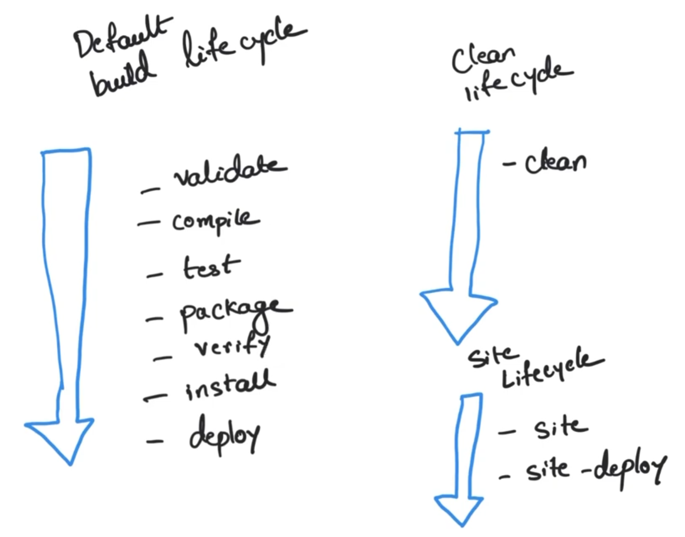
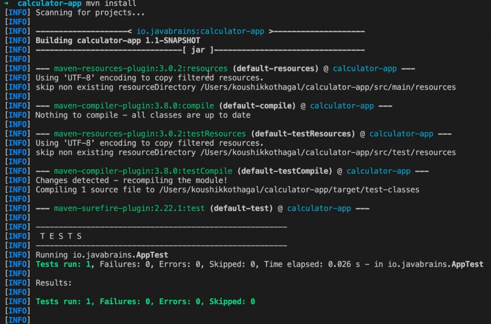

# Maven 

## Commands 
```bash
mvn --version
mvn archetype:generate
```
## Maven working


pom.xml - Project Object Model

## Maven Coordinates

<br></br>
---


## Compiling 
`mvn compile`

## Testing and packaging
`mvn test`
`mvn package`

## Declarative Dependency Management

[Maven repository](https://mvnrepository.com/)
1. Paste the dependency in pom.xml
2. Run `mvn dependency:copy-dependencies`

## Transitive Dependencies 


## Maven Strategies for Transitive Dependencies


## Dependency scopes
1. While compiling the source code, you don't need JUnit dependency, so you can mark it as `Test` scope.
2. The default scope Maven assumes is `compile` scope.
3.  - compile
    - test
    - provided (available during compile time and not available during runtime)
    - runtime (available during run time and not available compile runtime)
    - system (not often used)

## Declaring and using properties

```xml
<properties>
    <junit.version>4.12</junit.version>
</properties>

<dependencies>
    <dependency>
      <groupId>junit</groupId>
      <artifactId>junit</artifactId>
      <version>${junit.version}</version>
      <scope>test</scope>
    </dependency>
</dependencies>
```

## Maven Architecture in the Enterprise


## Running mvn install 
`mvn package` - It will package it and generate a jar locally. 

`mvn install` - It will package it and put it to .m2 directory (local)

## The Maven build lifecycle 


## Clean and site lifecycles 


## Maven Plugins 
- Maven is a plugin heavy architecture. 
- Plugins are adding phases to the Maven lifecyle. 
- `mvn pluginName:phaseName`
- `mvn compiler:compile` is same as `mvn compile`
- `mvn install`
<br></br>


## Maven Surefire Report Plugin

## Maven Code Quality Plugin

## Creating parent and child modules 
